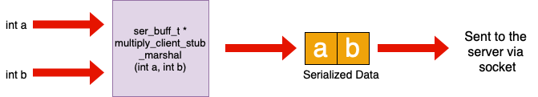
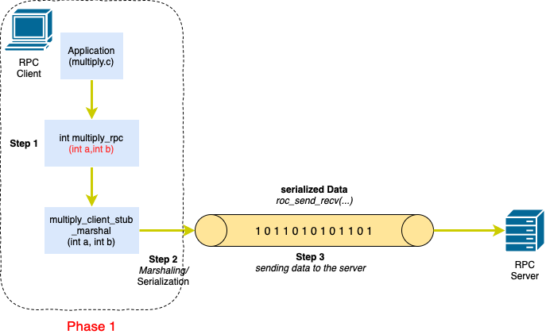
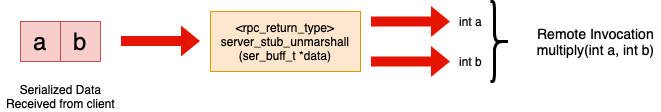
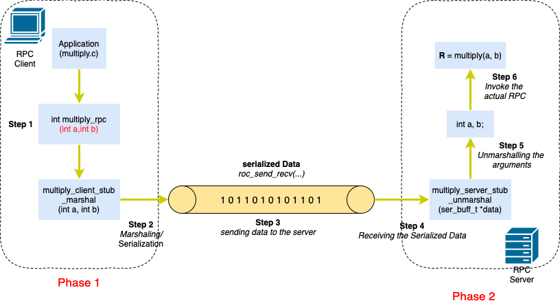

# RPC (<span style="color: green"> R</span>emote <span style="color: green"> P</span>rocedure <span style="color: green"> C</span>all)

RPC means invoking a function or procedure which is implemented and run on a remote machine in the network. In other words, in RPC, local application invokes the function which resides on a remote machine. RPC creates an **illusion** as if you are invoking the local function, but in reality that function is remote. Sometimes, we are not able to implement some functions or procedures due to the hardware constraints. It means that the hardware may not supports some features needed by the function. Therefore, the developer is forced to implement the function/procedure in a remote compatible physical machine.

The entire RPC mechanism can be divided into 9 steps:

1. Client program invokes the RPC with arguments.
2. Client program converts the arguments into serialized form of data.(Data Serialization/ Marshaling)
3. Client program ships the serialized data over the network to RPC server.
---(phase one: client side)---
4. RPC server receives the serialized data obtained in step 3 from client.
5. RPC server un-marshales the data received in step 4.(De-Serialization)
6. RPC server invokes the actual procedure with arguments.
7. RPC server has to perform serialization of the result.(Data Serialization/ Marshaling)
8. RPC server sends the serialized result back to the client.
---(phase 2: server side)---
9. client un-marshales the received serialized result.
---(phase 3: client side)---

## Phase 1
As you can see below, in client side there is a function to serialize the input argument.

* signature: ```ser_buff_t *multiply_client_stub_marshal(arg1, arg2, ...)```
* this function is responsible for serializing the arguments of the the RPC.

There is another important function in client which is responsible for sending and receiving serialized buffer is:
```
void rpc_send_recv(ser_buff_t *send_ser_data, ser_buff_t *empty_ser_buffer);
```
the value ```send_ser_data``` is the output of the ```multiply_client_stub_marshal()``` and ```empty_ser_buffer``` is the value which will be received from the server as the output. While client has not received the result, it will be blocked in this function. Big picture for implementing phase 1:


In server side, ```server_stub_unmarshall()``` is responsible for reconstructing arguments received from the client. As you can see, the signature of the function should be like below:
```
<rpc_return_type> server_stub_unmarshall(ser_buff_t *);
```


Big picture for implementing phase 2:




Note: At first, I tried to implement via UDP socket. But as I am on Mac OSX, I think recvfrom() system call is non-blocking. So, I preferred to use TCP socket, as the main purpose of this project is to understand what RPC is.
