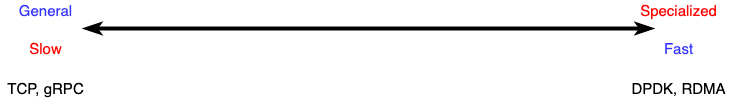

# eRPC

eRPC is a fast and general remote procedure call for datacenters. Modern datacenters are very fast, as we see 100Gbps datacenters with latency of 2microseconds between two hosts connected to the same switch, and switches add around 300nanosecond per hop. The problem in datacenter network is that existing networking options are trying to either sacrifice performance or generality. On the slow hand, we have TCP, gRPC, etc. which work in commodity datacenters and provide features needed to build applications like reliability and congestion control, but they are slow. On the other hand, we have fast but specialized options like DPDK and RDMA which make simplifying assumptions, while requires special hardware. One of the drawback in this field is limited applicability, which means we need specialized hardware to run them. But more fundamental drawback is that these systems co-design the application logic with the networking, and as a result, they lag modular networking abstraction which prevents reuse.

eRPC breaks away from this performance generality trade-off by providing both, that is **do not give up generality for high  performance**. To do so, we have to provide functionality equivalent to hardware solutions in software. For example, because we don't assume that (IX) provides end to end reliability and congestion control, we have to do it in software but without loosing performance. There were three main challenges that this paper had to solve to build the eRPC:
* this paper assumes that the network does not prevent packet loss. Therefore, there is a need to manage packet loss in software.
* There is a need to implement transport layer end to end reliability and congestion control with low overhead.
*  Needs to support larger feature sets, so that eRPC can be easily integrated into existing application code.

So, here is how challenges are addressed:
### 1) managing packet loss:
One problem in managing packet loss is **large timeouts**. When the drain rate is smaller than receiving rate, there will be packet loss. When this happens, the switch buffer starts filling up and when it is full, it starts dropping packets. Because the sender get no feedback from the network, it does not know when it is safe to re-transmit, so they use conservative approach for re-transmission which is in the order of miliseconds. RPC workloads commonly use small messages, so there is no need to rely on duplicate acknowledgements for faster re-transmission. Large timeouts are bad because they increase latency. For example, we're building a distributed system where clients hold locks on a remote object, if a client's unlock packets get dropped, the locked object still is locked for several miliseconds. As a result, contending requests from other clients will be failed, which leads to low performance. The prior solution for this problem was lossless link layer(PFC, Infiniband). In a lossless datacenter, before switch buffer fills up, the switch sends a feedback to the sender in a form of pause message, telling it to stop. So, in lossless datacenters, there is no need for re-transmission. However, link layer losslessness comes with trade-offs. Although it provides cheap and simple reliablility, it may cause Deadlock or unfairness. (Reliable link layer is an active field of research).

The approach which eRPC takes to solve this problem is that the researchers made an observation about normal datacenter networks that allows a simple method of preventing packet loss most of the time. Note that, there is no need to completely eliminate the packet loss. That is an extreme requirement which comes with drawbacks. what is needed for packet loss is to be rare enough to not affect the system performance, and this contribution has found that with a little help from software, existing network can satisfy this relaxed requirement.

There is a parameter which is called **Bandwidth Delay Product (BDP)** denotes the maximum size of sliding window to reach peak rate with available bandwidth:
```
BDP = Bandwidth * RTT
```
giving this information, in contrast, we see that in datacenter switches, there are around 12MB of buffer, which is 3 orders of magnitude larger than BDP. So, if software is limited to the amount of BDP, then switch can buffer hundreds of loads and prevents packet loss. So, this observation lets researchers to work on low latency NICs.

eRPC by limiting the window size to 19KB with 12MB of intermediate switch buffer, can achieve 640 nodes in many to one traffic pattern.

### 2) Low overhead transport layer
Many transport layer components like end 2 end reliability, congestion control and memory management are quite expensive, but this paper has found that most of the overhead can be avoided in the common case. in eRPC, it is assumed that the datacenter network is uncongested, therefore, eRPC implementation is optimized for uncongested networks. There, it uses Timely algorithm to control congestion that is, if RTT is high, then TX_Rate will decrease and vice versa.
